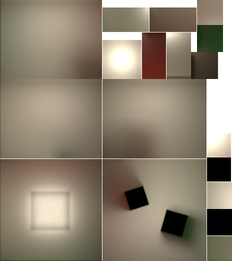

# tscene/bakery

Path-traced lightmaps for [`tscene`](../README.md) / three.js scenes, baked on a **headless WebGPU device in
Node**. No browser, no window, no display server — `webgpu` (Dawn) supplies the adapter, three's
`WebGPURenderer` runs the compute pass, and [`three-mesh-bvh`](https://github.com/gkjohnson/three-mesh-bvh)'s
WebGPU API owns the acceleration structure.

```sh
pnpm bake:bakery   # bakes scene/bakery-demo/scenes/room.tscene
pnpm dev:bakery    # the demo, press G to A/B baked GI against realtime direct light
```

<!-- the atlas the demo ships with: charts for the room, the two blocks and the ceiling panel -->


## What it does

- **GPU path tracing.** One compute dispatch per batch of paths, one thread per lightmap texel. A
  1024-sample bake of the demo room takes a few seconds.
- **Full global illumination.** Diffuse interreflection to any bounce depth, so colour bleeding is not a
  trick — the red and green walls tint the floor because photons actually went that way.
- **Emissive meshes are area lights.** Any material with a non-black `emissive` becomes a sampled emitter,
  picked in proportion to triangle area — and with an `emissiveMap`, each triangle carries the radiance of
  the texels it covers, so a strip light on a texture emits only where the texture is bright. A
  `RectAreaLight` joins the same estimator as two triangles.
- **three's own light math, verbatim.** `DirectionalLight`, `PointLight` and `SpotLight` reproduce
  `getDistanceAttenuation`, the distance window and the spot penumbra exactly, so a bake matches what the
  realtime renderer was already showing. `AmbientLight` and `HemisphereLight` collapse into a sky gradient.
- **Soft shadows.** `@bakery { radius }` on a light turns it into a sphere (or, for a directional light,
  an angular cone) and gives a real penumbra.
- **Transmissive shadows.** A shadow ray through a transparent material is attenuated by its coverage
  (`opacity`, `transmission`, the mean alpha of an `alphaMap` or cutout `map`) instead of being stopped, so
  glass and foliage cast the shadow they should.
- **Ambient occlusion in the same trace.** `@bakery { ao }` rides the first bounce ray, so a second atlas
  costs no extra dispatch.
- **Reflection probes for the metals.** A metal has no diffuse lobe for an atlas to light, so
  `@bakery { probe: 256 }` on a node bakes what a point in the scene sees in every direction, and
  `applyLightmap` puts the nearest one on each metallic material's `envMap`.
- **Settings live in the sheet.** `@bakery { … }` holds the bake's own knobs and picks which nodes are in
  it, so baking a scene is `tscene-bake scenes/room.tscene` and nothing else.
- **Irradiance, not colour.** The atlas holds `E`, which is exactly what three's `lightMap` slot wants,
  so applying a bake is a texture assignment — no custom material, no patched shader.

## Using it

Two entry points. `tscene/bakery` is browser safe and does nothing but apply a bake;
`tscene/bakery/node` is the baker and pulls in Dawn, sharp and xatlas.

```ts
// bake, in Node
import { bakeSceneFile } from "tscene/bakery/node";

// with no options at all, the sheet's own `@bakery { … }` block decides everything
const { files } = await bakeSceneFile("scenes/room.tscene", { size: 512, samples: 1024 });
```

```ts
// apply, in the browser
import { applyLightmap } from "tscene/bakery";

const lightmap = await applyLightmap(scene, "lightmaps/room.lightmap.json");
```

Applying a bake also zeroes the lights it already contains — leaving them on counts every direct
contribution twice. The handle owns that trade, so a baked/realtime A/B is one assignment:

| | |
|---|---|
| `lightmap.enabled = false` | atlas off, and every muted light back at the intensity the sheet declared |
| `lightmap.intensity = 4` | gain on the exposure the manifest carries, so 1 is "as baked" |
| `lightmap.lights` | `Map<Light, number>`: the bake's lights → the intensity each had. Scale a realtime pass through this rather than snapshotting your own |
| `lightmap.meshes` `.width` `.height` | what the atlas reached, and how big it is |
| `lightmap.ao` | the occlusion atlas, when the bake wrote one; already on the materials' `aoMap` |
| `lightmap.environment = 0` | gain on the reflection probes, independent of `enabled`. `lightmap.probes` is the textures |
| `lightmap.dispose()` | atlas off the materials, lights back, texture disposed |

A sheet that names its own bake applies it on load, so a scene arrives lit and there is nothing to wire up:

```scene
@bakery { lightmap: "/lightmaps/room.lightmap.json" }
```

`loadScene` resolves the url against the sheet (against the document, for a sheet the vite plugin bundled)
and leaves the handle on `root.userData.lightmap`. `loadScene(…, { lightmap: false })` ignores it — which is
what the baker itself passes, since applying an atlas mid-bake would zero the lights about to be traced.
The manifest's sibling `.png`/`.exr` cannot be bundled from inside the JSON, so keep all three in `public/`.

`bakeSceneFile` is `loadSceneFile` + `bake` + `writeBake`, and makes a headless renderer when it is not
handed one. Reach for the pieces when the scene is not a sheet on disk — `bake()` takes any
`THREE.Object3D` — or when one renderer bakes several scenes:

```ts
import { bake, createHeadlessRenderer, loadSceneFile, writeBake } from "tscene/bakery/node";

const renderer = await createHeadlessRenderer();
const result = await bake(await loadSceneFile("scenes/room.tscene"), { renderer, size: 512, samples: 1024 });
await writeBake(result, "public/lightmaps", "room");
```

`loadLightmap(url)` is the other half of `applyLightmap`: it returns `{ manifest, texture }`, which is
also what `applyLightmap` accepts in place of a url when two roots share one atlas.

### `@bakery` in the sheet

A scene's bake settings belong with the scene, not in the command that bakes it. `@bakery { … }` is
valid in three places: the sheet itself, a node, and a material.

```scene
/* the sheet's own block: every option of bakeSceneFile(), plus who is in the bake */
@bakery {
  out: "../public/lightmaps";
  size: 512;
  samples: 1024;
}

mesh #floor {
  geometry: planeGeometry(4, 4);
  material: meshStandardMaterial {
    /* the tracer guesses reflectance from map/color; this overrides the guess */
    @bakery { albedo: [0.5, 0.5, 0.5] };
  };
}

/* soft shadows: a sphere light of world radius 0.35 (a directional light reads radians) */
pointLight #lamp(#fff2d8, 6) {
  @bakery { radius: 0.35 };
}

/* out of the bake entirely — as an occluder and as a receiver, this node and its children */
group #props {
  @bakery { enabled: false };
}

/* casts and bounces light, but gets no atlas texels of its own */
mesh #railing {
  @bakery { enabled: occluder };
}

/* twice the atlas density this mesh would otherwise get */
mesh #detail {
  @bakery { density: 2 };
}

/* a reflection probe: 256x128 of radiance, captured at this node's world position */
object3D #probe {
  position: vec3(0, 1.2, 0);
  @bakery { probe: 256 };
}
```

`out` is relative to the sheet; the CLI's `--out` is relative to where it runs. Everything passed to
`bakeSceneFile` (or a CLI flag) wins over the sheet, and the sheet wins over the stage defaults.

Which meshes get baked is `include`, and `enabled` is the per-node say in it:

| | |
| --- | --- |
| `@bakery { include: all }` | the default: every visible mesh but the ones that turn themselves off |
| `@bakery { include: none }` | only the meshes that opt in with `@bakery { enabled: true }` |
| `@bakery { enabled: … }` on a node | applies to its whole subtree; the nearest one wins, so a child can opt back in |
| `@bakery { enabled: occluder }` | in the trace as geometry, out of the atlas: it shadows and bounces light but carries no texels. What a floor a camera never sees, or a mesh whose own shading stays realtime, wants |

`include` selects meshes, never lights: a light is an input to the bake, so it stays in whatever the mode.
`enabled: false` on a light means "stays live at runtime" instead — `applyLightmap` leaves it alone and it
is not in `lightmap.lights`.

`@bakery { density }` on a node scales the atlas density its subtree is unwrapped at — 2 for the mesh a
camera stands next to, 0.5 for a wall nobody reads. `texelsPerUnit` (or the automatic fit) sets the base.

A mesh the bake cannot represent — skinned, instanced, batched — warns and is skipped rather than baked
from a pose or a transform it will not be drawn with: a lightmap is one `uv1` per vertex of one geometry,
which none of the three has. `@bakery { enabled: false }` is how to say the omission is intended and take
the warning with it.

### Reflection probes

`@bakery { probe: <width> }` on any node — an `object3D` placed for the purpose is the usual one — bakes an
equirectangular map of the radiance leaving every direction around that node's world position, `width`
texels across and half that tall. The trace is the same estimator the atlas uses, started from the probe
instead of from a texel, so a probe agrees with the lightmap about the lighting and adds the one thing the
atlas leaves out: the emission of what it is looking at, because a reflection of a lamp has to show a lamp.

That is the specular half of a bake, and it exists because the diffuse half cannot cover a metal: three's
diffuse colour is `albedo * (1 - metalness)`, so a `metalness: 1` material renders the atlas as black no
matter how good the trace was. `applyLightmap` gives each mesh the probe whose position is nearest its
centre and puts it on that material's `envMap`, scaled by `metalness` — a dielectric's diffuse response to
the same light is already in the atlas, and an env map would add it twice. Place probes the way every other
baker's are placed: in the open space a viewer moves through, one per room or per visually distinct volume,
never inside geometry.

```scene
object3D #probe { position: vec3(0, 1.2, 0); @bakery { probe: 256 }; }
```

`lightmap.environment` is the gain on them at runtime, independent of `lightmap.enabled` — a metal reflects
whether or not the diffuse atlas is showing.

A node built by a loader is reached the same way anything else about it is, through `find()`:

```scene
gltf #level("/level.glb") {
  find("Glass") { @bakery { enabled: false }; }
}
```

### CLI

```sh
tscene-bake scenes/room.tscene            # settings come from the sheet's @bakery
tscene-bake scenes/room.tscene --size 512 --samples 1024 --exr
```

`--help` lists the rest (`--out`, `--name`, `--bounces`, `--indirect`, `--batch`, `--bias`, `--padding`,
`--texels-per-unit`, `--denoise`, `--dilate`, `--default-albedo`, `--include`, `--jobs`, `--only`). Unwrap,
rasterize and trace each print a percentage and a running estimate of what is left.

Three worth knowing:

| | |
| --- | --- |
| `--indirect <gain>` | the one knob that is not physical: a gain on everything gathered past the first bounce, so an interior that bakes flat can be pushed without touching the direct light. 1 is the truth |
| `--ao` `--ao-distance` | also write `<name>.ao.png` and put it on the materials' `aoMap`. The occlusion rides the first bounce ray, so it is free; `--ao-distance 0` picks 5% of the scene diagonal, which is a room-scale guess and the thing to set when the scene is not room-scale |
| `--bias <units>` | ray origin offset along the normal, against self-intersection. 0 picks 1e-4 of the scene diagonal; raise it if the atlas shows shadow acne, lower it if contact shadows detach |

`--jobs` is the rasterizer's worker count (one per core by default) — `--jobs 1` to rasterize on the main
thread. It only moves the rasterize stage; the trace is already on the GPU.

## Output

`writeBake` produces these next to each other:

| File | What |
| --- | --- |
| `<name>.png` | irradiance divided by an auto exposure, sRGB encoded. `manifest.intensity` is the divisor, and `applyLightmap` puts it back as `lightMapIntensity` |
| `<name>.lightmap.json` | the manifest: version, atlas size, exposure, and base64 `uv1` per baked mesh, keyed by node path |
| `<name>.ao.png` | with `--ao`: cosine-weighted openness, 1 = unoccluded. `applyLightmap` puts it on `aoMap` |
| `<name>.exr` | with `--exr`: the same irradiance as 32-bit float, unclipped. Also what `--only` re-traces from |
| `<name>.probeN.exr` | one per `@bakery { probe }`, in sheet order: equirectangular radiance, always 32-bit float — a reflection of a lamp is the one thing an 8-bit range cannot hold |

The manifest carries only uvs, not geometry, because `BufferGeometry.toNonIndexed()` is deterministic —
`applyLightmap` re-derives the same vertex order and refuses the atlas if the counts disagree. It also
carries a `version`, and `applyLightmap` refuses a manifest from a different one instead of decoding a
layout it no longer speaks: the fix is always a re-bake.

## How it works

| Stage | File | |
| --- | --- | --- |
| collect | [`scene.ts`](../src/bakery/scene.ts) | scene → world-space triangle soup, materials, lights, sky, emissive triangle list |
| unwrap | [`atlas.ts`](../src/bakery/atlas.ts) | lightmap uvs from xatlas (wasm), one atlas for the whole scene |
| rasterize | [`raster.ts`](../src/bakery/raster.ts) | atlas texel → the world position and normal to shade, across `--jobs` worker threads writing into one `SharedArrayBuffer` |
| trace | [`tracer.ts`](../src/bakery/tracer.ts) | the estimator, as WGSL, over three-mesh-bvh's `BVHComputeData` |
| filter | [`filter.ts`](../src/bakery/filter.ts) | edge-aware denoise, then dilation past the chart edges so bilinear taps never read black |
| probe | [`probe.ts`](../src/bakery/probe.ts) + `tracer.ts` | one equirect of radiance per placed probe, from the same estimator |
| pack | [`io.ts`](../src/bakery/io.ts) | PNG / EXR / manifest |

The estimator is the part worth reading twice. It integrates **irradiance**, so bounces are
cosine-sampled and the π from the estimator cancels the 1/π from the Lambert BRDF — every bounce is just
a multiply by the hit surface's albedo. Direct lighting is next-event estimation only (analytic for delta
lights, area sampling for emissive triangles) and emission is never added on a bounce hit, so nothing is
counted twice and there is no MIS weight to get wrong. Bounce 0 walks a randomized Hammersley set, which
is what keeps the sample counts low.

## Checks

```sh
pnpm --filter tscene test     # CPU: rasterization, light conventions, manifest round trip
pnpm --filter tscene check    # GPU: the radiometry, against closed forms
```

The GPU check is the interesting one — every configuration in it has an irradiance you can write down,
so a shader that is merely plausible still fails:

| Setup | Expected |
| --- | --- |
| unshadowed directional light, normal on | `E = color * intensity` |
| the same light behind an occluder | `E = 0` |
| a uniform sky of radiance `L` | `E = π L` |
| a square emitter of radiance `L` overhead | `E = π L F`, the parallel-square view factor |
| a perfectly red floor under that sky | `E.r = π` exactly (albedo 1 is a furnace), `E.g = π (1 - F)` |
| `--ao` under a square lid | openness `= 1 - F`, the same view factor from the other side |

The last one is the colour-bleeding check and the sharpest: any energy the bounce loses or invents shows
up as a deviation from π.

Unlike the rest of the repo, this check needs a working GPU — which is the whole point of the baker.

## Known ceilings

Everything deliberately left simple is marked with a `ponytail:` comment naming the upgrade path. The
ones worth knowing about:

- **Albedo is per texel where a lightmapped surface has a `map`**, sampled through the same UVs the
  atlas uses, so a bounce off a checkerboard bleeds the square it actually hit. Everything else — a
  surface the ray hits that owns no lightmap texel, a material with no decodable map — falls back to one
  colour per material: the mean of its `map` (sampled on a stride, not every texel), darkened by the mean of
  its `metalnessMap` (glTF leaves `metalness` at 1 and puts the real value in the texture). A material with
  no colour at all gets `defaultAlbedo`. `@bakery { albedo }` overrides all of it.
- **Coverage is one number per material**, from `opacity`/`transmission` and the mean alpha of the map, so a
  shadow through a stained-glass window is grey rather than coloured and a cutout leaf shadows as a uniform
  haze. Per-texel alpha in the shadow ray is the upgrade.
- **AO is a single distance-limited openness term**, not a directional bent normal: it multiplies what the
  material already gets from three's `aoMap`, and stacking it on a bake that already contains the
  occlusion is double-darkening by taste rather than by physics.
- **Reflection probes are points, with no volume and no blending.** A mesh reflects the probe nearest its
  centre, which partitions the scene into Voronoi cells: the reflection changes in one step across a
  boundary, and a mesh spanning two cells picks the one its centre is in. Influence volumes (Unity's box,
  Unreal's sphere) and a blend between the two nearest are the upgrade, and both are a field in the
  manifest rather than a different shape. There is no parallax correction either — a probe is sampled as
  if infinitely far away, so a box-projected room reflects at the wrong angle up close. The bake warns
  when a scene has metals and no probe at all.
- **A probe reaches baked meshes only**, and its gain is scaled by `metalness`, so a partial metal
  (`metalness: 0.5`) double counts half of the environment's diffuse contribution — the atlas already has
  that half. Splitting the probe into its specular and diffuse parts is the fix, which means two textures
  per probe.
- **Shadow rays run a closest-hit query** because three-mesh-bvh has no any-hit shapecast yet, so a
  shadow ray costs a full traversal.
- **The area-light estimator clamps its solid angle**, which slightly darkens the first centimetre around
  an emitter. It is what stops a shading point a millimetre from a panel from returning millions and
  spraying fireflies across the atlas; sampling the triangle by solid angle (Arvo) would remove the
  singularity outright. Texels *on* an emissive surface are still noisy — harmless, since their own
  albedo is what the lightmap gets multiplied by.
- **No seam fixing.** Charts meet exactly, but a bilinear tap across a seam does not solve for
  continuity; dilation hides the worst of it.
- `three-mesh-bvh`'s WebGPU API is documented as unstable, and [one small `.d.ts`](../src/bakery/three-mesh-bvh-webgpu.d.ts)
  declares the exports it ships without types.
